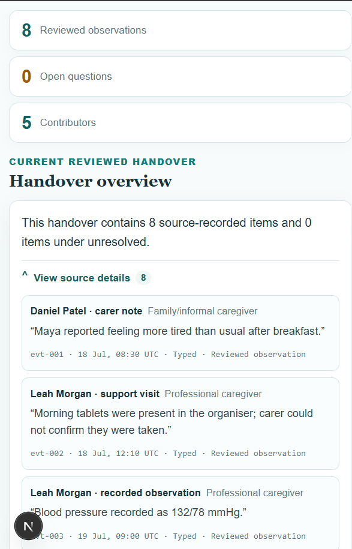
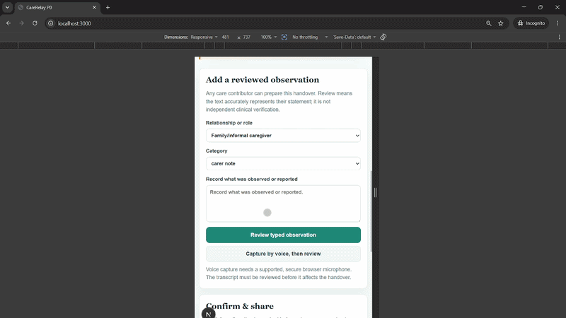
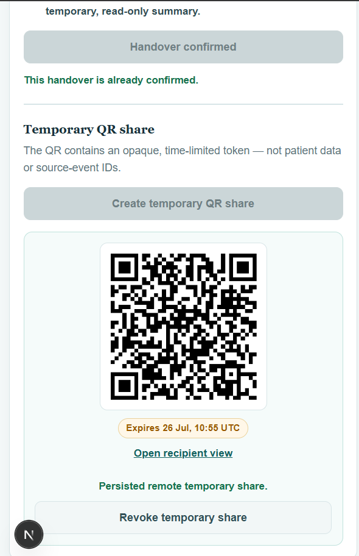
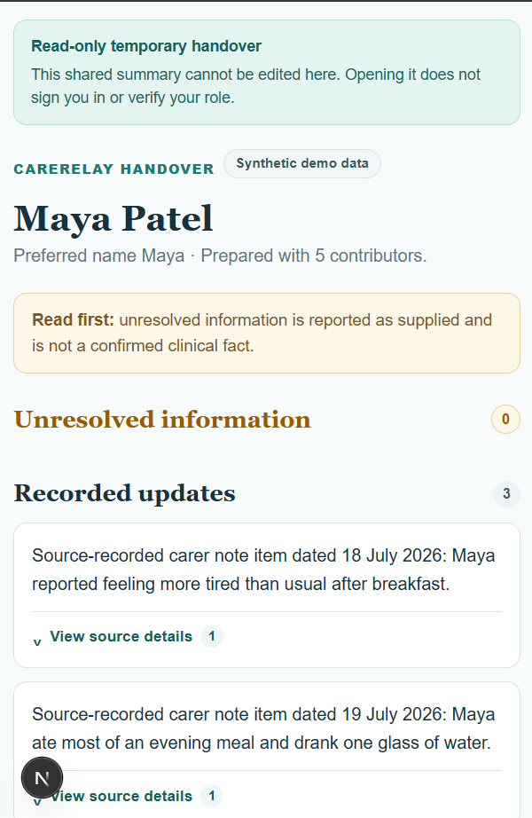

# CareRelay

**Source-grounded clinical handovers that move safely with the patient.**

CareRelay turns fragmented care-event data into a concise, traceable clinician
handover. Every generated claim links to the source event that supports it,
uncertainty is shown rather than guessed, and confirmed handovers can be shared
through an expiring, revocable, read-only QR code.

> **Hackathon prototype:** CareRelay uses fixed, synthetic patient data only.
> It does not provide diagnosis, triage, or treatment recommendations.

## Why CareRelay

Critical context is often scattered across care settings, organisations, and
systems. Reconstructing what happened takes time; presenting incomplete or
ambiguous information as fact can cause harm.

CareRelay demonstrates a safer handover model: keep every statement within the
boundary of the record, make uncertainty visible, and require an intentional
human decision before information leaves the care team.

## The demo, end to end

### 1. Start with the evidence

The Maya demonstration handover separates source-recorded updates from open
questions. Selecting **View source details** lets a recipient inspect the event
behind a statement rather than treating the summary as a new source of truth.



### 2. Capture a contribution, then review it

The separate Aisha draft demonstrates that voice capture is consent-gated.
Recording starts only after a deliberate user action and the browser's
microphone-permission prompt. A transcript remains an editable draft: it must
be reviewed before it can become a source event or be marked as needing
clarification.



### 3. Confirm and create a temporary QR share

Sharing is not automatic. After confirmation, CareRelay creates an opaque,
time-limited QR link that can be revoked when the transfer is complete.



### 4. Give the receiver a focused, read-only handover

The recipient view is mobile-friendly and cannot be edited. It carries the
same source-grounded updates and explicit unresolved information without
exposing the wider editing workflow.



## Safety model

- **Evidence before assertion:** generated claims must reference recorded
  `sourceEventIds`.
- **Uncertainty stays visible:** incomplete evidence appears under
  `unresolved`; it is not promoted to an established fact.
- **Voice is not a shortcut to truth:** an incoming transcript requires review
  before it affects a handover.
- **Human confirmation gates sharing:** a handover must be explicitly
  confirmed before a temporary share can be created.
- **Temporary access is controllable:** QR handovers are read-only, expire, and
  can be revoked.
- **Tokens are handled defensively:** persistence stores only a cryptographic
  hash of a share token, never its raw value.
- **The repository contains no real patient data.**

The frozen prototype contract is documented in
[`docs/p0-contract.md`](docs/p0-contract.md), with the canonical TypeScript
interfaces in [`src/types/care.ts`](src/types/care.ts).

## What the prototype demonstrates

- Structured handovers built from fragmented care events
- Claim-level traceability and source-event inspection
- Reviewed typed and voice contributions, with provenance retained
- Explicit unresolved questions when the record is incomplete
- Confirmation-gated, expiring, revocable QR sharing
- A mobile-friendly, read-only recipient experience
- A reliable local demo using two fixed synthetic journeys: Maya's established
  handover and Aisha's draft contribution flow

## Validation

The complete QR flow was tested across two physical devices on the same
network: a phone scanned an expiring code and opened the mobile-friendly,
read-only Maya handover.

## Run locally

The primary demo uses a deterministic local fallback, so no API keys or remote
services are required.

```bash
npm install
npm run dev
```

Then open [http://localhost:3000](http://localhost:3000).

Optional checks:

```bash
npm run lint
npm run typecheck
npm run test:structured
npm run test:supabase-mapping
```
